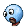
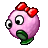
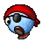
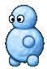
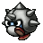
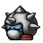

Badguy Name
===========

Character description...

---

### Behavior During Gameplay

Badguy gameplay description...

| Property       | Status |
|----------------|--------|
| Squishable     | yes    |
| Buttjumpable   | yes    |
| Burnable       | yes    |
| Freezable      | yes    |

-----

# Snow Family

The snow family of creatures is the most common group Tux encounters during his journey on Icy Island. They used to be quite friendly and curious beings before being forced by Nolok to gone on the attack. Ocassionally equipped with the occassional spiky or flying gear, the snowballs follow the commands of their captains in the hopes to return to their carefree lives after a job well done.

Mr. Snowball
===========

Mr. Snowball is a simple little snowball creature who enjoy the social interaction with others of their kind. They would probably consider long walks across the snowy lands a quite fine activity.

---

### Behavior During Gameplay

Mr. Snowball is a straight forward walking enemy, when reaching an edge he will fall down and continue walking on the platform below. To defeat them, simply jumping on them is simply enough.

| Property       | Status |
|----------------|--------|
| Squishable     | yes    |
| Buttjumpable   | yes    |
| Burnable       | yes    |
| Freezable      | no     |

Mrs. Snowball
=============

Mrs. Snowball is a simple little snowball creature who enjoy the social interaction with others of their kind. They would probably consider long walks across the snowy lands a quite fine activity.

---

### Behavior During Gameplay

Mrs. Snowball behaves just like Mr. Snowball with the soul difference that they do not fall of ledges. Instead they will turn around and walk the other way.

| Property       | Status |
|----------------|--------|
| Squishable     | yes    |
| Buttjumpable   | yes    |
| Burnable       | yes    |
| Freezable      | no     |

Captain Snowball
================

Captain Snowball is proud leader of their kind. They do not enjoy sending their friends into a fight with this penguin however, knowing whhat awaits them if they don't, they got no other choice and hope it will all be over soon.

---

### Behavior During Gameplay

Captain Snowball behaves just like Mr. Snowball though they are slightly faster and when reaching a ledge or a small incline, they will make an attempt to jump over it.

| Property       | Status |
|----------------|--------|
| Squishable     | yes    |
| Buttjumpable   | yes    |
| Burnable       | yes    |
| Freezable      | no     |

Bouncing Snowball
=================

Bouncing Snowball does not believe in flying gear. They believe in ones own strength and thus try to prove that they can reach great highst with a simple , yet strong bounce!

---

### Behavior During Gameplay

Bouncing Snowball continusly bounces in an arch while moving forward. If they fall off a platform, depending on how deep they fall, their next bounce will shoot them higher after which their bouncing height continusly returns back to normal.

| Property       | Status |
|----------------|--------|
| Squishable     | yes    |
| Buttjumpable   | yes    |
| Burnable       | yes    |
| Freezable      | no     |

Flying Snowball
---------------

When the first Snowball build the first flying gear, while many enojyed this new tool and started using it to explore the lands, a subgroup of others tried to prove that these were not needed if you knew how to gain enough height from a perfect bounce.

---

### Behavior During Gameplay

Flying Snowball simply moves up and down on the spot.

| Property       | Status |
|----------------|--------|
| Squishable     | yes    |
| Buttjumpable   | yes    |
| Burnable       | yes    |
| Freezable      | no     |

Kamikaze Snowball
-----------------

Kamikaze Snowball actually split of from the Bouncing Snowballs faction after discovering the use of cannons. They are determind to establish them as the new methode of long distance travel, shooting themselves across the antarctic islands. Some snowballs either call them insane, or very “wise” for this.

---

### Behavior During Gameplay

The Kamikaze Snowball shoots out of a [cannon](https://github.com/SuperTux/supertux/wiki/Badguys-Misc#Cannon) and flies in a straight line until crashing into a solid wall.

| Property       | Status |
|----------------|--------|
| Squishable     | yes    |
| Buttjumpable   | yes    |
| Burnable       | yes    |
| Freezable      | no     |

Snowman
-------

One day, a Mr. Snowball wondered if they become stronger if they add more snow to their body. It did work to an extend. With more snow on their body they stood taller and now even had a pair of hands. Unfortunatly, the amounts of snow made the Snowball moch heavier and thus quite slower.

---

### Behavior During Gameplay

Snowman behaves exactly like a Mr. Snowball but is much slower and when hit, their body breaks and they continue on as a Mr. Snowball. However, a buttjump will defeat them in one go!

| Property       | Status |
|----------------|--------|
| Squishable     | yes    |
| Buttjumpable   | yes    |
| Burnable       | yes    |
| Freezable      | no     |

Spiky
-----

The Spiky unit are a group of Snowballs that decided to wear protective armor that would encourage attackers to stay away to not hurt them selves. If it weren't for some of their members to be quite know for their sleepy-ness their reputation would be a bit stronger overall. Oh well, you win some, you loose some.

---

### Behavior During Gameplay

Spiky behaves exactly like a Mr. Snowball but is immune to jumping and buttjumping on them and harm the player should they try to do so.

| Property       | Status |
|----------------|--------|
| Squishable     | yes    |
| Buttjumpable   | yes    |
| Burnable       | yes    |
| Freezable      | yes    |

Snowjumpy
---------

The Spiky unit are a group of Snowballs that decided to wear protective armor that would encourage attackers to stay away to not hurt them selves. If it weren't for some of their members to be quite know for their sleepy-ness their reputation would be a bit stronger overall. Oh well, you win some, you loose some.

---

### Behavior During Gameplay

Spiky behaves exactly like a Mr. Snowball but is immune to jumping and buttjumping on them and harm the player should they try to do so.

| Property       | Status |
|----------------|--------|
| Squishable     | yes    |
| Buttjumpable   | yes    |
| Burnable       | yes    |
| Freezable      | yes    |
