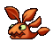

Badguy Name
===========

Character description...

---

### Behavior During Gameplay

Badguy gameplay description...

| Property       | Status |
|----------------|--------|
| Squishable     | yes    |
| Buttjumpable   | yes    |
| Burnable       | yes    |
| Freezable      | yes    |

-----

### Content List

1. Icy Island
   - Snow Family
2. Rooted Forest
   - Flora
   - Fauna
3. Miscellaneous
   - Jumpy
   - Crusher
   - Bomb Units

-----

# Snow Family

The snow family of creatures is the most common group Tux encounters during his journey on Icy Island. They used to be quite friendly and curious beings before being forced by Nolok to gone on the attack. Ocassionally equipped with the occassional spiky or flying gear, the snowballs follow the commands of their captains in the hopes to return to their carefree lives after a job well done.

Mr. Snowball
============

Mr. Snowball is a simple little snowball creature who enjoy the social interaction with others of their kind. They would probably consider long walks across the snowy lands a quite fine activity.

---

### Behavior During Gameplay

Mr. Snowball is a straight forward walking enemy, when reaching an edge he will fall down and continue walking on the platform below. To defeat them, simply jumping on them is simply enough.

| Property       | Status |
|----------------|--------|
| Squishable     | yes    |
| Buttjumpable   | yes    |
| Burnable       | yes    |
| Freezable      | no     |

Mrs. Snowball
=============

Mrs. Snowball is a simple little snowball creature who enjoy the social interaction with others of their kind. They would probably consider long walks across the snowy lands a quite fine activity.

---

### Behavior During Gameplay

Mrs. Snowball behaves just like Mr. Snowball with the soul difference that they do not fall of ledges. Instead they will turn around and walk the other way.

| Property       | Status |
|----------------|--------|
| Squishable     | yes    |
| Buttjumpable   | yes    |
| Burnable       | yes    |
| Freezable      | no     |

Captain Snowball
================

Captain Snowball is a proud leader of their kind. They do not enjoy sending their friends into a fight with this penguin, Tux, however, knowing what awaits them if they don't, they got no other choice and hope it will all be over soon.

---

### Behavior During Gameplay

Captain Snowball behaves just like Mr. Snowball though they are slightly faster and when reaching a ledge or a small incline, they will make an attempt to jump over it.

| Property       | Status |
|----------------|--------|
| Squishable     | yes    |
| Buttjumpable   | yes    |
| Burnable       | yes    |
| Freezable      | no     |

Bouncing Snowball
=================

Bouncing Snowball does not believe in flying gear. They believe in ones own strength and thus try to prove that they can reach great heights with a simple, yet strong bounce!

---

### Behavior During Gameplay

Bouncing Snowball continusly bounces in an arch while moving forward. If they fall off a platform, depending on how deep they fall, their next bounce will shoot them higher after which their bouncing height continusly returns back to normal.

| Property       | Status |
|----------------|--------|
| Squishable     | yes    |
| Buttjumpable   | yes    |
| Burnable       | yes    |
| Freezable      | no     |

Flying Snowball
---------------

When the first Snowball build the first flying gear, while many enojyed this new tool and started using it to explore the lands, a subgroup of others tried to prove that these were not needed if you knew how to gain enough height from a perfect bounce.

---

### Behavior During Gameplay

Flying Snowball simply moves up and down on the spot.

| Property       | Status |
|----------------|--------|
| Squishable     | yes    |
| Buttjumpable   | yes    |
| Burnable       | yes    |
| Freezable      | no     |

Kamikaze Snowball
-----------------

Kamikaze Snowball actually split of from the Bouncing Snowballs faction after discovering the use of cannons. They are determind to establish them as the new methode of long distance travel, shooting themselves across the antarctic islands. Some snowballs either call them insane, or very “wise” for this.

---

### Behavior During Gameplay

The Kamikaze Snowball shoots out of a [cannon](https://github.com/SuperTux/supertux/wiki/Badguys-Misc#Cannon) and flies in a straight line until crashing into a solid wall.

| Property       | Status |
|----------------|--------|
| Squishable     | yes    |
| Buttjumpable   | yes    |
| Burnable       | yes    |
| Freezable      | no     |

Snowman
-------

One day, a Mr. Snowball wondered if they become stronger if they add more snow to their body. It did work to an extend. With more snow on their body they stood taller and now even had a pair of hands. Unfortunatly, the amounts of snow made the Snowball moch heavier and thus quite slower.

---

### Behavior During Gameplay

Snowman behaves exactly like a Mr. Snowball but is much slower and when hit, their body breaks and they continue on as a Mr. Snowball. However, a buttjump will defeat them in one go!

| Property       | Status |
|----------------|--------|
| Squishable     | yes    |
| Buttjumpable   | yes    |
| Burnable       | yes    |
| Freezable      | no     |

Spiky
-----

The Spiky unit are a group of Snowballs that decided to wear protective armor that would encourage attackers to stay away to not hurt them selves. If it weren't for some of their members to be quite know for their sleepy-ness their reputation would be a bit stronger overall. Oh well, you win some, you loose some.

---

### Behavior During Gameplay

Spiky behaves exactly like a Mr. Snowball but is immune to jumping and buttjumping on them and harm the player should they try to do so.

| Property       | Status |
|----------------|--------|
| Squishable     | no     |
| Buttjumpable   | no     |
| Burnable       | yes    |
| Freezable      | yes    |

---

# Rooted Forest

Vicious Ivy
===========

Vicious Ivy is a small leaf like creature that loves to hide in trees and bushes. They also use the forest winds to glide and hover above the ground for a while which is beautfiul to look at when there is a large group of them. We Granito like to keep them as pets. Since we are made of rock they cannot really harm us so we usually find their attempts to bite us rather cute. I do have my own little guy, whom I named "Vivi".

---

### Behavior During Gameplay

Vicious Ivy behave similar to Mr. Snowball, that is a straight forward walking enemy. When reaching an edge they will instead slowy descend and continue walking on the platform below.

To defeat them, simply jumping on them is simply enough.

| Property       | Status |
|----------------|--------|
| Squishable     | yes    |
| Buttjumpable   | yes    |
| Burnable       | yes    |
| Freezable      | yes    |

Walking Leaf
============

Walking Leaf, not to be confused with their green cousins, yet quite similar in nature. They are especially common during fall as they blend in quite nicely with their enviorment. If you're wondering whether or not Walking Leaf and Vicious Ivy get along - they do! Atleast my sweet Vivi seems to not be bothered by them and I yet have to see two of them fighting.

---

### Behavior During Gameplay

Walking Leaf behave the same as Vicious Ivy, acting as their "smart variant" for Rooted Forest, meaning that they will turn around when approaching a ledge. However they will still slowy descend and continue walking on the platform below should they fall off it somehow.

To defeat them, simply jumping on them is simply enough.

| Property       | Status |
|----------------|--------|
| Squishable     | yes    |
| Buttjumpable   | yes    |
| Burnable       | yes    |
| Freezable      | yes    |

Leafshot
========

Character description...

A Vicious Ivy that decided falling from a tree is not the most exciting part in life went ahead and hoped to one day be shot back into a tree. Sadly, the lack of hands makes it impossible for Leafshot to point the cannon upwards. Thus the cannon only shoots him out in a straight line until crashing.

### Behavior During Gameplay

Badguy gameplay description...

| Property       | Status |
|----------------|--------|
| Squishable     | yes    |
| Buttjumpable   | yes    |
| Burnable       | yes    |
| Freezable      | yes    |

Mr. Tree
========

What makes the forest of Rooted Forest feel so alive? Why our livly Mr. Trees of course! There is nothing more lively then a living tree itself. Just make sure you don't bump into one, they might run over you as they are often preoccupied mentally with all the Vicious Ivys bustling amongst their luscious leaves.

---

### Behavior During Gameplay

Badguy gameplay description...

| Property       | Status |
|----------------|--------|
| Squishable     | yes    |
| Buttjumpable   | yes    |
| Burnable       | yes    |
| Freezable      | yes    |

Snail
=====

Character description...

---

### Behavior During Gameplay

Badguy gameplay description...

| Property       | Status |
|----------------|--------|
| Squishable     | yes    |
| Buttjumpable   | yes    |
| Burnable       | yes    |
| Freezable      | yes    |

Igel
====

Igel can be found plentiful across our vast forests, both on the surface as well as underground. Cute little guys those Igel. Don't be too harsh on them should one roll into you. They are easily scared and only wish to defend themselves. It's nothing personal.

Because they are of organic matter, the corruption hit Igel amongst the hardest. I will never forget witnessing my very first Corrupted Igel. Poor soul...

---

### Behavior During Gameplay

Badguy gameplay description...

| Property       | Status |
|----------------|--------|
| Squishable     | no     |
| Buttjumpable   | no     |
| Burnable       | yes    |
| Freezable      | yes    |

Mole
====

Mainly found underground, Moles ocassionally show their cute little faces peeking out of their little mole hills. They are always so pre occupied with digging they don't pay much attention to where they throw their rocks and dirt. Just be careful, they mean no harm. I once was visited by a family of moles when they found themselves digging into my basement walls. A funny sight to behold.

I don't even wanna think about their fate when the Corruption struck. When you live soley underground... it's a trajedy, if you think about it...

---

### Behavior During Gameplay

Badguy gameplay description...

| Property       | Status |
|----------------|--------|
| Squishable     | yes    |
| Buttjumpable   | yes    |
| Burnable       | yes    |
| Freezable      | yes    |

Owl
===

The Owls can be heard everywhere during the night in Rooted Forest. There used to be a time where many of their parliament were obducted or attacked by Zeeklings rather frequently. This caused them to become rather paranoid, attacking anyone that was not part of their kind. We decided it was best to just let them be. It's nothing personal but an intruder is an intruder, atleast that's what I hope they think.

---

### Behavior During Gameplay

Owl flys high above Tux carrying a Skydive. Once Tux is close enough they will drop their Skydive whilst continuing onwards themselves.

| Property       | Status |
|----------------|--------|
| Squishable     | yes    |
| Buttjumpable   | yes    |
| Burnable       | yes    |
| Freezable      | yes    |

Zeekling
========

Zeeklings sure are vicious creatures charging at anything that moves in their line of sight. If it weren't for them, Rooted Forest would be much more secure and calm place to live in. You will get used to it over time but they are still very much a pain to deal with. On the other hand though, they look so cute, don't you think?

---

### Behavior During Gameplay

Badguy gameplay description...

| Property       | Status |
|----------------|--------|
| Squishable     | yes    |
| Buttjumpable   | yes    |
| Burnable       | yes    |
| Freezable      | yes    |

---

# Miscellaneous

Miscellaneous badguys can appear and be encountered in any world. Some of them dawn different looks however remain the same otherwise.

Jumpy
=====

Jumpy is a really a creature then it is a common title used to discribe those using a spring mechanicsm to achive impressive height. In Icy Island this title was giving to the snowballs using a modfied "Spiky" armor to imcorporate a spring. The ones in Rooted Forest are still a mystery to many. It is unclear who or what they are as they don't really seem faced by the corruption taking a hold of some of them. All that is known about them is that they arrived soon after Nolok sat foot on that part of the world. Metaljumpy are of Nolok's own design, inspired by the original Totemjumpy from his home.

---

### Behavior During Gameplay

Jumpy simply bounces up and down on a stationary spot, being harmful to Tux due to their spiky shell.

| Property       | Status |
|----------------|--------|
| Squishable     | no     |
| Buttjumpable   | no     |
| Burnable       | yes    |
| Freezable      | yes    |

Crusher
=======

Through out all different evirnoments, sentient creatures formed of the ground surrunding them, known as Crusher can be found. With their watchful eyes, they scan the enviornment waiting for the right moment to strike. Some say depending on where they're from their personallity is what sets them appart... not sure if that is true though.

---

### Behavior During Gameplay

A Crusher will wait for Tux to walk right underneeth them and move towards them at incredible speeds.
There are also variants which will only trigger when standing to their left or right, commonly referred to as a "Side Crusher".

The **Corrupted Crusher** type is the only Crusher with an additional attack. When their body hits the ground or a wall, three roots will be summoned to its left and right (above and below for Side Crusher!) piercing through the ground and retracting soon after.

| Property       | Status |
|----------------|--------|
| Squishable     | no     |
| Buttjumpable   | no     |
| Burnable       | no     |
| Freezable      | no     |

Mr. Bomb
========

Mr. Bomb is the most common bomb type of Nolok's forces. Like all others, they we're contructed in the Bomb Factory, succeeding their original model. They take their job very serious and try their best to be of great service to Nolok. I doubt he cares much, based on what we know of him.

---

### Behavior During Gameplay

Mr. Bomb walks back and forth, turning around when approaching ledges. Jumping on them will light their fuse. Once lit Tux can carry them around and throw them at other enemies or crates, heavy crates or weak tiles to destroy them. A lit Mr. Bomb will detonate in about 4 seconds.

| Property       | Status |
|----------------|--------|
| Squishable     | yes    |
| Buttjumpable   | yes    |
| Burnable       | yes    |
| Freezable      | yes    |

Mr. Bomb "Senior"
=================

The original Mr. Bomb a.k.a. "Old Bomb" or "Mr. Bomb Senior" is the very first bomb ever created by Nolok during his time in Tropical Paradise. They were used during the heist in Granito Stronghold to steal and claim the Corrupted Sceptre. They are a very proud bomb often shown in rough comments of "encouragment" towards the other, newer bomb types to be better. Specifically current Mr. Bomb gets it the worst due to them sharing the same name, being their direct successor model.

---

### Behavior During Gameplay

Mr. Bomb Senior acts the exact same as Mr. Bomb, the only difference being that their fuse takes much less time to explode.

| Property       | Status |
|----------------|--------|
| Squishable     | yes    |
| Buttjumpable   | yes    |
| Burnable       | yes    |
| Freezable      | yes    |

Haywire
=======

Haywire is a funny little fellow who appears to be the most joyful of all the bombs. That is only partly true as Haywire also seems to suffer some being rather easily infuriated. The slightest touch will turn their jolly nature into a vilont outburst of anger that can affect anyone involved. It is adicved to not stand in their way if you find yourself near an enraged Haywire as they WILL know no mercy. If you are the one to have enraged them, your best chance of surivival is to run as fast as you can to not surcome to their kamikaze attempt.

---

### Behavior During Gameplay

Hawyire walks back and forth, turning around when approaching ledges. Jumping on them will light their fuse, enraging them. Once lit Haywire will begin chasing down Tux for 5 seconds before they ultimatly explode. While chasing Tux they will kill most enemies they come across, with a few exceptions. If they run into another bomb, both will detonate on touch!

| Property       | Status |
|----------------|--------|
| Squishable     | yes    |
| Buttjumpable   | yes    |
| Burnable       | yes    |
| Freezable      | yes    |

Gold Bomb
=========

Gold Bomb's shiny shell isn't doing them any favors. If anything they are a walking target which might explain why they are so easily scared. They usually hide away out of sight in hopes to get some peace and quite and avoid detection. Last time a Gold Bomb was spotted in the open, they bumped into a Haywire by accident and got chased down a cliff soon after. Whenever I find a coin out in the open it makes me wonder...

---

### Behavior During Gameplay

Gold Bomb acts the exact same as Mr. Bomb, however, when approached by either Tux or a lit Bomb of any kind they will attempt to run away and flee the scene.

| Property       | Status |
|----------------|--------|
| Squishable     | yes    |
| Buttjumpable   | yes    |
| Burnable       | yes    |
| Freezable      | yes    |

Dive Mine
=========

Dive Mine are Nolok's aquatic bomb unit. Considering not much is happening in the water most of time they are very eager when something finally does happen. Where as Haywire despies any form of unauthorized touch, Dive Mine are almost seeking it out. Despite those differences, both Dive Mine and Haywire would consider the other their best friend.

---

### Behavior During Gameplay

Dive Mine remains stationary in the water floating up and down ever so slightly. If in range they will slowly paddle their towards Tux, detonating upon contact.

| Property       | Status |
|----------------|--------|
| Squishable     | yes    |
| Buttjumpable   | yes    |
| Burnable       | yes    |
| Freezable      | yes    |

Short Fuse
==========

Short Fuse is a rather harmless little guy. Looking like a baby version of Mr. Bomb, most of the other bomb units treat them constantly like a child. That does not mean they bully them for being the small one but rather they tend to forget that even they can demonstrate a good amount of force once detonated. Maybe not in destruction but in knockback.

---

### Behavior During Gameplay

Short Fuse walks back and forth, turning around when approaching ledges. Jumping on them will detonate them immideatly. However, instead of exploding Short Fuse will pop pushing Tux away

| Property       | Status |
|----------------|--------|
| Squishable     | yes    |
| Buttjumpable   | yes    |
| Burnable       | yes    |
| Freezable      | yes    |

Hellbent
========

Hellbent are highly aggressive bombs, souly focused on their task at hand. Once the are locked on target, all you can do is run!

---

### Behavior During Gameplay

Hellbent will permanetly chase down Tux when close by, though unlike Haywire, they will not explode after a certain amount of time. Once they start chasing Tux, Hellbent will only explode by contact with either Tux, another enemy or a solid wall.

| Property       | Status |
|----------------|--------|
| Squishable     | yes    |
| Buttjumpable   | yes    |
| Burnable       | yes    |
| Freezable      | yes    |

Rusty Bomb
==========

Not much is known about Rusty Bombs outside of its uses. It is even unclear rather or not they are even alive. Unlike their fellow bomb units, they seemingly show no sign of personallity nor emotion. Rusty Bombs may simpy be nothing but a transportation vessel for other bombs, specifically Hellbent. Only a few have been spotted in the Tropical Islands, near the temple but only from a far.

---

### Behavior During Gameplay

Rusty Bomb slowly walks back and forth, turning around when approaching ledges. Jumping on them will light their fuse. Due to their size, Tux cannot throw them nor will he have much time to do so, as they will explode soon after being ignited. When they explode, they release 2 Hellbents that will chase down Tux.

| Property       | Status |
|----------------|--------|
| Squishable     | yes    |
| Buttjumpable   | yes    |
| Burnable       | yes    |
| Freezable      | yes    |
